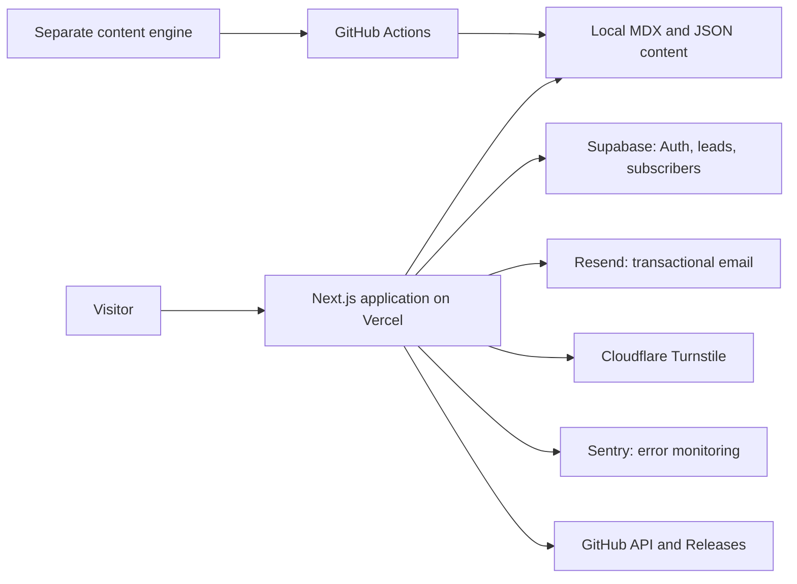

# XDCoderz

Production website for [XDCoderz](https://www.xdcoderz.xyz/), an independent software studio that ships focused products, practical business systems, open-source experiments, and useful web tools.

[Live website](https://www.xdcoderz.xyz/) | [Portfolio](https://www.xdcoderz.xyz/portfolio) | [Open Product Lab](https://www.xdcoderz.xyz/lab) | [Contact](mailto:grow.xdcoderz@gmail.com)

## The Product

XDCoderz is designed as more than a brochure site. It is a modular product platform that brings together:

- Software products, including GridForge and future desktop, Android, web, and SaaS applications.
- Outcome-led services for websites, custom software, automation, and operational systems.
- A searchable blog for original articles and weekly market-signal content.
- A tools directory with isolated, extractable interactive utilities.
- An open-source Lab that surfaces public projects alongside live GitHub metadata.
- A protected operations area for reviewing contact leads, subscribers, and Lab submissions.

The aim is simple: turn a studio website into a reliable operating surface for building, publishing, measuring interest, and starting client conversations.

## What This Demonstrates

This project was built as an end-to-end Next.js application, not a static landing page.

- Server-rendered routes, metadata, sitemap, robots policy, structured data, and content-driven SEO.
- Responsive light and dark theme system shared across the full application.
- Modular product, service, blog, tools, Lab, subscriber, and admin domains.
- Supabase-backed contact leads, newsletter subscribers, authentication, and restricted operations access.
- Resend transactional email for contact and subscription flows.
- Cloudflare Turnstile verification for public forms.
- Sentry monitoring, Vercel Analytics, and Vercel Speed Insights for production visibility.
- GitHub Releases for large product downloads and server-cached GitHub API data for Lab project cards.
- A separate GitHub Actions content engine that can create and publish weekly market-signal posts without coupling generation logic to the core website.

## Architecture



The website is intentionally modular. Routes provide page composition, while feature folders own domain-specific UI and behavior. That makes a successful tool or product easier to extract into a standalone application later.

## Project Structure

```text
src/
  app/          Next.js routes, layouts, API endpoints, metadata routes
  components/   Shared layout and reusable interface components
  config/       Site identity, navigation, and feature configuration
  content/      Editorial blog content and curated Lab project records
  data/         Product, service, platform, and business-content models
  features/     Isolated domains such as blog, tools, admin, subscribers, and Lab
  lib/          Integrations and shared server/client helpers

docs/           Product direction, operating notes, and next-phase plan
```

The current tools system follows a deliberate extraction path:

```text
src/features/tools/
  software-cost-estimator/
  workflow-audit/
  project-ideas-generator/
  components/
  data/
  tool-registry.tsx
```

Each route under `src/app/tools` is intentionally thin. Tool-specific behavior stays in `src/features/tools/<tool-name>`, so it can evolve independently or become its own app when there is demand.

## Technology

| Area | Implementation |
| --- | --- |
| Framework | Next.js 16, React 19, TypeScript |
| Styling | Tailwind CSS 4, responsive design system, light/dark themes |
| Data and authentication | Supabase SSR and Supabase JavaScript client |
| Email | Resend |
| Bot protection | Cloudflare Turnstile |
| Monitoring | Sentry |
| Product analytics | Vercel Analytics and Speed Insights |
| Deployment | Vercel with a custom domain |
| Content automation | GitHub Actions in the separate `xdcoderz-content-engine` repository |
| Product distribution | GitHub Releases |

## Content Operations

Manual, original articles live in `src/content/blog` as MDX files. Weekly market digests live beside them as structured JSON content.

The automated workflow is deliberately separate from this repository:

1. The `xdcoderz-content-engine` gathers and ranks relevant market and product signals.
2. GitHub Actions generates a weekly post and commits it into this website's blog content.
3. Vercel detects the change and deploys the updated site.

This keeps AI and automation concerns outside the website's runtime while allowing content to use the same editorial rendering, SEO, and design system as manually written articles.

## Local Development

### Prerequisites

- Node.js 20 or later
- npm
- A Supabase project, Resend API key, Turnstile keys, and Sentry DSN only when testing those integrations locally

### Run the application

```powershell
npm install
Copy-Item .env.example .env.local
npm run dev
```

Open [http://localhost:3000](http://localhost:3000).

Useful checks:

```bash
npm run lint
npm run build
```

## Environment Configuration

Copy `.env.example` to `.env.local` and provide only the integrations you need. Never commit `.env.local` or any production secret.

| Group | Variables |
| --- | --- |
| Site email identity | `XDCODERZ_SERVICE_EMAIL`, `CONTACT_FROM_EMAIL`, `CONTACT_REPLY_TO_EMAIL`, `NEWSLETTER_FROM_EMAIL` |
| Newsletter | `NEWSLETTER_PROVIDER` and optional provider-specific credentials |
| Supabase | `NEXT_PUBLIC_SUPABASE_URL`, `NEXT_PUBLIC_SUPABASE_PUBLISHABLE_KEY`, `SUPABASE_SERVICE_ROLE_KEY` |
| Admin access | `ADMIN_EMAILS` |
| Email | `RESEND_API_KEY` |
| Turnstile | `NEXT_PUBLIC_TURNSTILE_SITE_KEY`, `TURNSTILE_SECRET_KEY` |
| Sentry | `NEXT_PUBLIC_SENTRY_DSN`, `SENTRY_DSN`, `SENTRY_ENVIRONMENT`, `SENTRY_ORG`, `SENTRY_PROJECT`, `SENTRY_AUTH_TOKEN` |

Public-prefixed environment variables are intentionally limited to values that are safe for the browser. Privileged keys remain server-only.

## Security and Reliability Practices

- Public forms are validated on the server and protected with Turnstile.
- Admin access uses Supabase Auth with an explicit allowlist of administrator email addresses.
- Sensitive credentials are environment variables, not source code.
- Supabase service-role access is kept on server-side paths only.
- Sentry captures production errors so faults can be investigated quickly.
- GitHub data failures degrade gracefully, keeping Lab cards useful even when external API data is unavailable.
- Large downloadable releases are served from GitHub Releases rather than committed to the website repository.

## Build Direction

The project is actively evolving around a clear principle: ship small, commercially useful systems, then let real demand decide what deserves to become a larger product.

Current and planned capabilities include software products, services, content publishing, lead capture, newsletters, tools, and open-source projects. The detailed operating roadmap is available in [docs/NEXT_PHASE_BUILD.md](./docs/NEXT_PHASE_BUILD.md).

## Author

Built and maintained by [Aditya Sharma](https://www.xdcoderz.xyz/portfolio).

For project work, software collaboration, or hiring conversations: [grow.xdcoderz@gmail.com](mailto:grow.xdcoderz@gmail.com).
